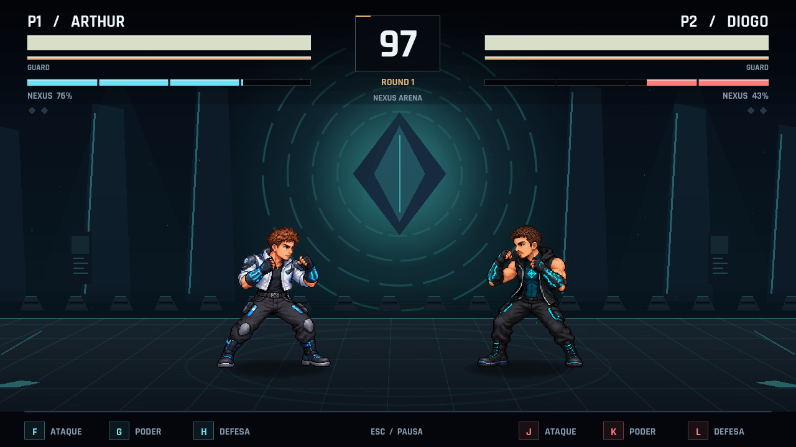

# NEXUS KOMBAT — Arcade Edition

Versão jogável 0.1 para Windows, em Godot 4.6. Sete lutadores baseados nas referências autorizadas, dez arenas e combate local em um único teclado ou dois controles.



## Jogar

Baixe **NexusKombat-Windows.zip** na [última versão publicada](https://github.com/diogolibinacio200-coder/nexus-kombat/releases/latest), extraia o ZIP e abra **NexusKombat.exe**. O jogo abre em tela cheia, sem editor, terminal ou mouse. O arquivo contém os recursos da partida; mantenha os arquivos de créditos que acompanham a distribuição. Para abrir o código-fonte, siga a seção de projeto abaixo.

1. No menu, selecione **VERSUS** com W/S ou as setas e confirme com F, J ou Enter.
2. P1 escolhe com WASD e confirma com F; P2 usa setas e J. H/L desfazem a escolha.
3. Escolha a arena, confirme e avance pela tela VS. Ataque também pula a introdução.
4. Vença a maioria dos rounds e escolha **REMATCH**, seleção ou menu.

| Ação | Player 1 | Player 2 |
|---|---|---|
| Mover / pular / agachar | WASD | Setas |
| Ataque | F | J |
| Poder | G | K |
| Defesa | H | L |
| Agarrão / escapar do agarrão | F + H | J + L |
| Sexto especial / Super com 100% | F + G | J + K |

Frente e trás são relativos ao adversário. Direção + ataque e direção + poder mudam o golpe. Não é necessário segurar uma direção para a defesa comum: ela tem botão próprio.

**Start / Enter / Esc:** pausa durante a luta. **F11:** alterna tela cheia. No treino, **Tab** abre as opções e **R** restaura posições; as opções também estão no menu de pausa, acessível pelo controle. **F3** ativa o diagnóstico, desligado por padrão.

## Modos e sistemas

- **Versus:** dois jogadores, escolha simultânea, mirror match com variação visual, seleção de arena, rounds, resultado e revanche.
- **Arcade:** sequência de seis confrontos, incluindo Nexus Prime. O chefe muda de fase sem ganhar atributos base; há um final fictício para cada integrante.
- **Training:** dummy parado, defendendo, pulando, atacando ou com IA; opções de vida, energia e guarda, histórico de comandos, frame data, hitboxes e reset.
- **Tournament:** quatro inscrições locais, duas semifinais e final. Em cada confronto, os participantes correspondentes assumem P1/P2.
- **How to Play:** nove páginas, listas de especiais e tutorial de oito etapas.
- **Attract:** após 25 segundos de inatividade no menu, uma luta entre IAs. Um botão retorna ao menu.
- **Settings / Statistics / Credits:** configuração e registro local de partidas, vitórias, combos, Perfect Blocks, Guard Breaks e Supers.

Todos compartilham 1000 HP, 100 de guarda, 100 de Nexus, velocidade de caminhada, gravidade e impulso de salto. Há oito ataques normais contextuais, seis especiais por lutador, técnica defensiva, agarrão e Super. Os dados ficam separados da simulação.

A defesa gasta guarda e permite chip damage. Perfect Block usa uma janela de cinco frames; frente + defesa permite parry em três frames. Golpes têm startup, active, recovery, hitstun, blockstun e pushback. Combos têm redução de dano, de hitstun e limites de cancelamento/juggle. Acertos fortes aplicam hit stop e efeitos moderados de câmera.

Um Super confirmado inicia seis impactos em 270 passos fixos, aproximadamente 4,5 segundos. O relógio e os dois lutadores ficam controlados pela sequência. Bloquear ou fazer o Super errar não captura o adversário.

## Controles e gabinete

Em **Settings → Remapear controles**, selecione P1/P2, escolha uma ação e pressione a tecla ou o botão desejado. O mapeamento é salvo. O padrão de gamepad é direcional/analógico para movimento, A para ataque, B para poder, X para defesa, Start para pausa e Back para voltar. Índices de botões seguem o mapeamento da Godot.

Encoders que emulam teclado usam a mesma configuração. Os eixos, a inversão, a zona morta e o dispositivo de gamepad também têm configuração persistente no Input Manager; veja o guia técnico.

A leitura é independente por jogador e aceita várias teclas por passo. **Ghosting físico precisa ser verificado no teclado/encoder real**: software não recupera uma tecla que o dispositivo não envia. A tela de controles mostra as teclas pressionadas de P1/P2 para testar combinações.

O perfil fica em `%APPDATA%/Godot/app_userdata/NEXUS KOMBAT/profile.json`, com gravação temporária e recuperação por backup. Não é necessário editar esse arquivo para os ajustes disponíveis nos menus.

## Abrir e modificar o projeto

1. Instale a versão **Godot 4.6 Standard**, utilizada nos testes. [Download oficial da versão](https://godotengine.org/download/archive/4.6-stable/).
2. Importe `project.godot` e aguarde a importação dos recursos.
3. Pressione F6 na cena principal ou F5 para executar o projeto.

O projeto usa o renderer **Compatibility**, viewport de 1280 × 720 e simulação de 60 Hz. A interface escala para 1920 × 1080. O gabinete foi pensado para 16:9.

| Arquivo / pasta | Responsabilidade |
|---|---|
| `scripts/main.gd` | Fluxo de telas, modos e rounds |
| `scripts/input_manager.gd` | Teclado, gamepads, comandos simultâneos e remapeamento |
| `scripts/combat.gd` | Simulação fixa, contatos, defesa, combos, projéteis e Supers |
| `scripts/fighter.gd` | Estado e atributos compartilhados; hurtbox/pushbox |
| `scripts/move_db.gd` | Identidades, golpes e tipos de habilidade |
| `data/balance.json` | Configuração editável de frame data e valores dos golpes |
| `scripts/ai.gd` | IA com reação e aleatoriedade reproduzível |
| `scripts/arena_view.gd` | Sprites, poses, arenas, efeitos e apresentação dos Supers |
| `scripts/interface.gd` | HUD e menus desenhados para arcade |
| `scripts/audio_manager.gd` | Música, vozes, pool de efeitos e volumes |
| `scripts/save_manager.gd` | Configuração e estatísticas persistentes |
| `assets/` | Sprites, fontes e áudio incluídos |
| `tests/` | Verificações de combate, módulos, fluxo e apresentação |

Edite `data/balance.json` e reinicie o jogo no editor para testar os valores. `name`, `kind` e `family` são identidades protegidas; mudanças de comportamento são feitas no MoveDB. As técnicas defensivas têm o sufixo `[DEFENSE]` na configuração para separar golpes de mesmo nome. O arquivo `data/roster.json` é um catálogo exportado; a definição ativa do elenco permanece no MoveDB.

Veja **[docs/TECHNICAL.md](docs/TECHNICAL.md)** para criar lutadores, golpes e arenas, trocar sprites, acrescentar skins e áudio. Os prompts da arte estão em **[assets/fighters/PROMPTS.md](assets/fighters/PROMPTS.md)**. Os geradores de áudio estão em `tools/`.

## Exportar Windows

Instale os templates de exportação da Godot **4.6**. No editor: **Project → Export → Windows Desktop → Export Project**. A configuração produz `NexusKombat.exe`, com PCK embutido e sem console.

Ou, em PowerShell:

```powershell
./tools/build.ps1 -Godot 'C:/caminho/Godot_v4.6-stable_win64_console.exe'
```

Se o template não estiver instalado, acrescente `-WindowsReleaseTemplate 'C:/caminho/windows_release_x86_64.exe'`. O script restaura a configuração após a exportação. `-Output` permite escolher o destino.

O destino padrão é `../Windows/NexusKombat.exe`: uma pasta `Windows` ao lado da pasta do projeto, criada pela exportação. O repositório contém o código-fonte; os binários prontos para jogar ficam nas Releases.

## Testar

```powershell
./tools/test.ps1 -Godot 'C:/caminho/Godot_v4.6-stable_win64_console.exe'
```

O teste de apresentação usa uma janela real e todas as arenas:

```powershell
& 'C:/caminho/Godot_v4.6-stable_win64_console.exe' --path . --script res://tests/presentation_test.gd
```

As evidências e os limites da validação estão em **[docs/QA.md](docs/QA.md)**.

## Estado desta entrega

Esta é uma base jogável e expansível, com sistemas de luta implementados e arte própria. **Não representa um jogo AAA finalizado.** Os oito atlas (sete integrantes e Nexus Prime) têm oito poses cada, complementadas por animação procedural e efeitos; ainda não equivalem a dezenas de animações artesanais com vários quadros por estado. Os retratos de seleção/VS/vitória são composições e recortes dessas poses. O narrador é sintético, e as arenas são cenários procedurais 2D.

Os testes automatizados ajudam a detectar erros de regras e regressões; a validação de balanceamento competitivo, qualidade da sensação de jogo e hardware do gabinete ainda exige sessões presenciais com jogadores. Recomenda-se essa avaliação antes do uso em evento.

Créditos e licenças: **[LICENSES.md](LICENSES.md)**.

